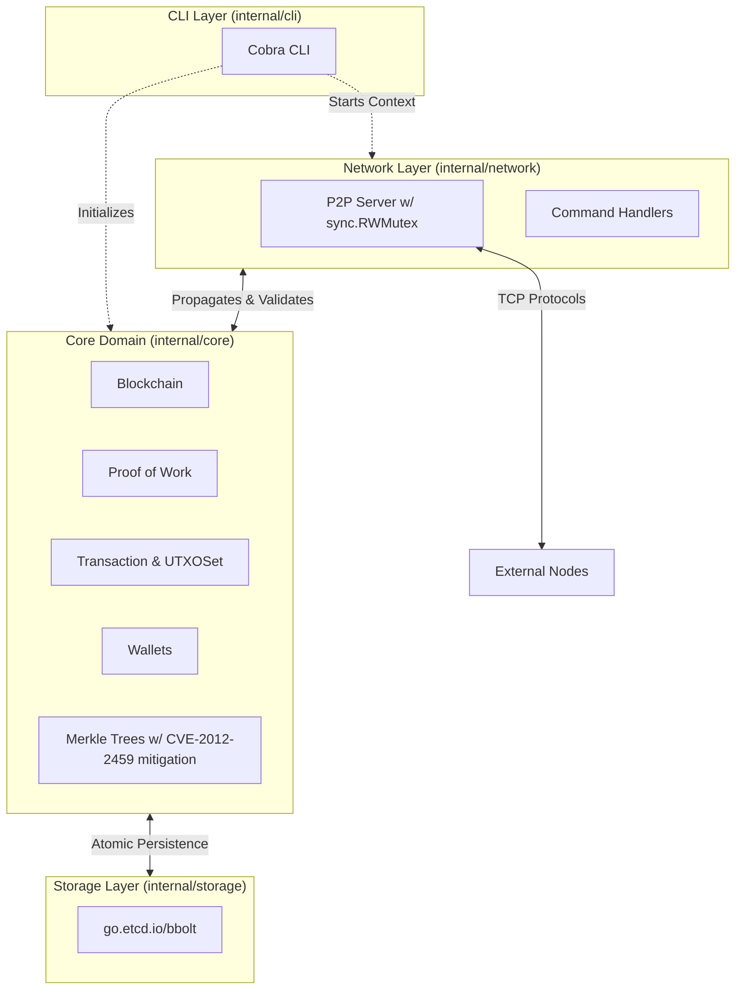

# Go Blockchain

[](https://go.dev/)
[](https://github.com/pouyasadri/go-blockchain/actions)
[](https://goreportcard.com/report/github.com/pouyasadri/go-blockchain)
[](https://github.com/pouyasadri/go-blockchain/actions)
[](https://opensource.org/licenses/MIT)

A fully-featured, educational blockchain server and node implementation written entirely in Go. This showcase project demonstrates advanced Go system design best practices, robust testing methodologies, secure cryptographic engineering, and modern Go features (such as `iter.Seq` range-over-func).

## ✨ Features

- **Decentralized P2P Network**: Robust TCP-based server communication to propagate blocks and transactions across nodes. Includes protection against memory exhaustion DoS vectors via `io.LimitReader` and strict message size limits.
- **Proof-of-Work Consensus**: Implementation of a dynamic difficulty PoW mining algorithm with performance optimizations for caching Merkle Trees.
- **UTXO Model**: Unspent Transaction Output (UTXO) model for accurate balance checking and validation.
- **Elliptic Curve Cryptography**: Secure wallet generation and transaction signing using ECDSA (`secp256r1`) and SHA-256. Employs canonical signing and proper zero-padding fixes for deterministic signature lengths.
- **Persistent Storage**: Efficient key-value data management backed by `go.etcd.io/bbolt`, featuring atomic multi-key transactions for crash-safe state updates.
- **Modern CLI**: Intuitive command-line interface powered by `Cobra`.

## 🏗 System Architecture

The architecture is built using highly cohesive, decoupled domains to ensure maintainability, concurrency-safety, and testability:



### Technical Highlights
- **Thread Safety**: The P2P node `Server` utilizes `sync.RWMutex` to protect shared state (mempool, known nodes, blocks in transit) across concurrent connection handlers.
- **Data Integrity**: Database interactions leverage BoltDB's atomic transactions to commit blocks and update chain tips simultaneously, eliminating the risk of torn writes during crashes.
- **Cryptographic Correctness**: Implements strict `ecdsa` signature normalization. Public keys and signature tuples (r, s) are properly zero-padded to `P-256` boundaries (32 bytes), avoiding non-deterministic decoding errors.
- **Memory Safety**: Network endpoints are secured using `io.LimitReader` to bound memory allocation during payload deserialization, thwarting resource-exhaustion attacks.

## 🚀 Getting Started

### Prerequisites

- [Go](https://go.dev/) 1.25 or later.

### Installation

1. **Clone the repository:**
   ```bash
   git clone https://github.com/pouyasadri/go-blockchain.git
   cd go-blockchain
   ```

2. **Build the CLI executable:**
   ```bash
   go build -o node ./cmd/node
   ```

### Quick Start Guide

**1. Create a Wallet:**
```bash
./node createwallet
# Outputs: Your new address: <Base58 Address>
```

**2. Initialize the Blockchain:**
```bash
./node createblockchain --address <Your_Address>
```
*This generates the genesis block and mines the first reward to your wallet.*

**3. Check Balance:**
```bash
./node getbalance --address <Your_Address>
```

**4. Start the Node Server:**
```bash
# Terminal 1 (Miner node)
export NODE_ID=3000
./node startnode --miner <Your_Address>
```

## 🧪 Testing and CI

This repository is heavily tested with end-to-end and unit coverage of core mechanics (Proof of Work, Serialization, UTXOs). To run tests locally:

```bash
# Run unit, integration, and e2e tests
go test -v ./...

# Calculate test coverage
go test -coverprofile=coverage.out ./...
go tool cover -html=coverage.out
```
A continuous integration (CI) pipeline leverages GitHub actions to enforce code standards using `golangci-lint` and executes tests on every push or pull request to the main branch.

## 🤝 Contributing

Contributions, issues, and feature requests are always welcome! 
Please refer to the [Contributing Guide](CONTRIBUTING.md) for details on our code of conduct, pull request process, and development standards.

## 📄 License

This project is licensed under the MIT License - see the `LICENSE` file for details.
