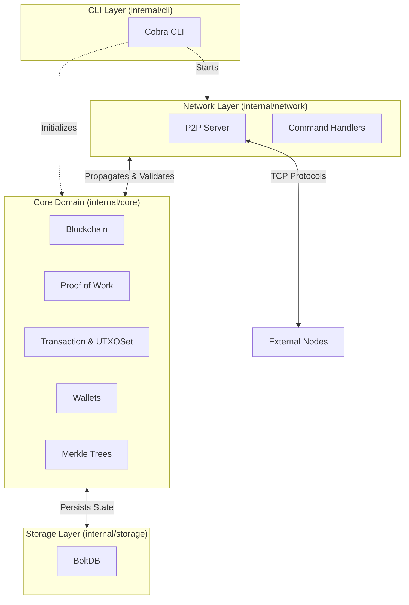

# Go Blockchain

[](https://go.dev/)
[](https://github.com/pouyasadri/go-blockchain/actions)
[](https://goreportcard.com/report/github.com/pouyasadri/go-blockchain)
[](https://github.com/pouyasadri/go-blockchain/actions)
[](https://opensource.org/licenses/MIT)

A fully-featured, educational blockchain server and node implementation written entirely in Go. This showcase project demonstrates advanced Go system design best practices, robust testing methodologies, and modern Go features.

## ✨ Features

- **Decentralized P2P Network**: Robust TCP-based server communication to propagate blocks and transactions across nodes.
- **Proof-of-Work Consensus**: Implementation of a dynamic difficulty PoW mining algorithm.
- **UTXO Model**: Unspent Transaction Output (UTXO) model for accurate balance checking and validation.
- **Elliptic Curve Cryptography**: Secure wallet generation and transaction signing using ECDSA (`secp256r1`) and SHA-256.
- **Persistent Storage**: Efficient key-value data management backed by BoltDB.
- **Modern CLI**: Intuitive command-line interface powered by `Cobra`.

## 🏗 System Architecture

The architecture is built using highly cohesive, decoupled domains to ensure maintainability and testability:



- **`internal/core`**: The heart of the blockchain, encapsulating blocks, cryptography, transactions, and consensus.
- **`internal/storage`**: Interfaces and implementations (like BoltDB) abstracting database interactions.
- **`internal/network`**: Handles all asynchronous peer-to-peer TCP protocols and message routing.
- **`internal/cli`**: The entrypoint and CLI wrapper using dependency injection for seamless testing.

## 🚀 Getting Started

### Prerequisites

- [Go](https://go.dev/) 1.25 or later.

### Installation

1. **Clone the repository:**
   ```bash
   git clone https://github.com/pouyasadri/go-blockchain.git
   cd go-blockchain
   ```

2. **Build the CLI executable:**
   ```bash
   go build -o node ./cmd/node
   ```

### Quick Start Guide

**1. Create a Wallet:**
```bash
./node createwallet
# Outputs: Your new address: <Base58 Address>
```

**2. Initialize the Blockchain:**
```bash
./node createblockchain --address <Your_Address>
```
*This generates the genesis block and mines the first reward to your wallet.*

**3. Check Balance:**
```bash
./node getbalance --address <Your_Address>
```

**4. Start the Node Server:**
```bash
# Terminal 1 (Miner node)
export NODE_ID=3000
./node startnode --miner <Your_Address>
```

## 🧪 Testing and CI

This repository is strictly tested with >70% coverage. To run tests locally:

```bash
# Run unit, integration, and e2e tests
go test -v ./...

# Calculate test coverage
go test -coverprofile=coverage.out ./...
go tool cover -html=coverage.out
```
A continuous integration (CI) pipeline leverages GitHub actions to enforce code standards using `golangci-lint` and executes tests on every push or pull request to the main branch.

## 🤝 Contributing

Contributions, issues, and feature requests are always welcome! 
Please refer to the [Contributing Guide](CONTRIBUTING.md) for details on our code of conduct, pull request process, and development standards.

## 📄 License

This project is licensed under the MIT License - see the `LICENSE` file for details.
