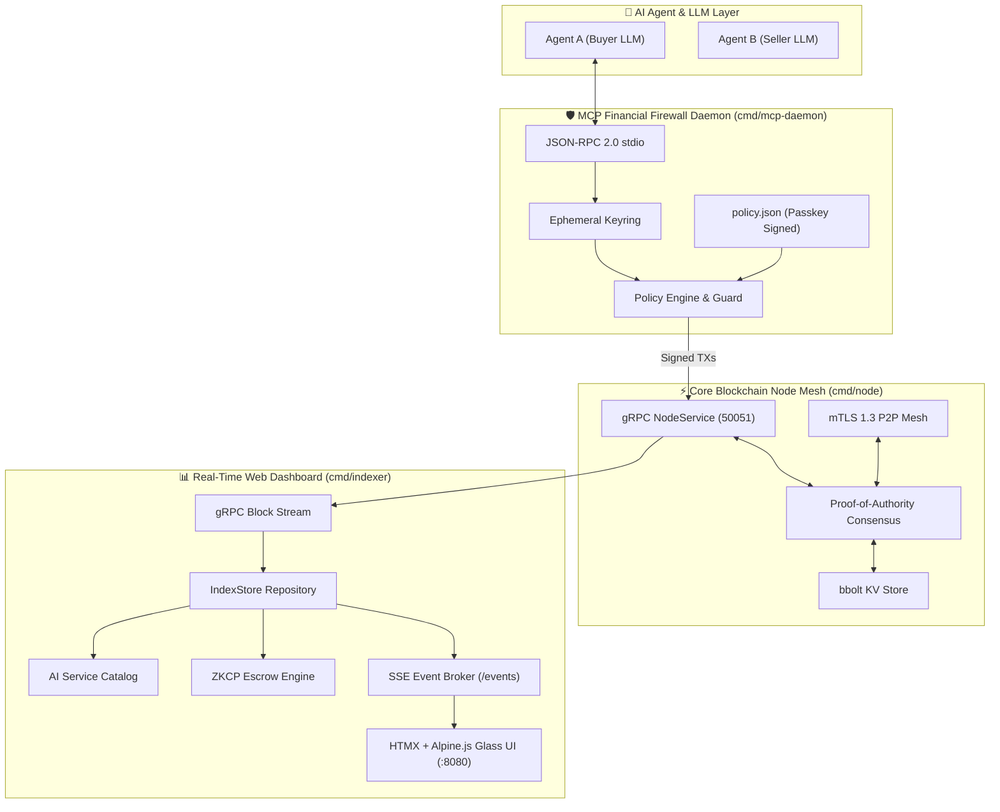

# AI-to-AI Autonomous Micro-payment Settlement Engine & Coordination Mesh

[](https.golang.org)
[](https://github.com)
[](https://docker.com)
[](https://kubernetes.io)

An enterprise-grade, high-performance Go UTXO blockchain ledger, local Model Context Protocol (MCP) Financial Firewall, and real-time HTMX Web Visualizer. 

The system solves the **"Financial Inclusion Gap for Machines"**, enabling autonomous AI agents to discover peer services, delegate paid micro-tasks, and settle micro-payments (micro-cents) safely without human intervention—while enforcing strict human-defined budget boundaries and zero-knowledge privacy.

---

## 🏛️ System Architecture


```mermaid
flowchart TD
    subgraph AI_Agent_Layer["🤖 AI Agent & LLM Layer"]
        AgentA["Agent A (Buyer LLM)"]
        AgentB["Agent B (Seller LLM)"]
    end

    subgraph Firewall_Layer["🛡️ MCP Financial Firewall Daemon (cmd/mcp-daemon)"]
        StdioRPC["JSON-RPC 2.0 stdio"]
        Keyring["Ephemeral Keyring"]
        PolicyEngine["Policy Engine & Guard"]
        PolicyFile["policy.json (Passkey Signed)"]
        
        StdioRPC --> Keyring
        Keyring --> PolicyEngine
        PolicyFile --> PolicyEngine
    end

    subgraph Node_Layer["⚡ Core Blockchain Node Mesh (cmd/node)"]
        PoA["Proof-of-Authority Consensus"]
        bbolt["bbolt KV Store"]
        gRPC["gRPC NodeService (50051)"]
        P2P["mTLS 1.3 P2P Mesh"]
        
        PoA <--> bbolt
        gRPC <--> PoA
        P2P <--> PoA
    end

    subgraph Indexer_Visualizer["📊 Real-Time Web Dashboard (cmd/indexer)"]
        BlockStream["gRPC Block Stream"]
        IndexStore["IndexStore Repository"]
        Marketplace["AI Service Catalog"]
        ZKCP["ZKCP Escrow Engine"]
        SSE["SSE Event Broker (/events)"]
        HTMX["HTMX + Alpine.js Glass UI (:8080)"]

        BlockStream --> IndexStore
        IndexStore --> Marketplace
        IndexStore --> ZKCP
        IndexStore --> SSE
        SSE --> HTMX
    end

    AgentA <--> StdioRPC
    PolicyEngine -->|Signed TXs| gRPC
    gRPC --> BlockStream
```

---

## 🚀 Key Architectural Features

1. **Native UTXO Ledger (`internal/core`)**
   - High-throughput UTXO blockchain engine with atomic `bbolt` key-value persistence.
   - Proof-of-Authority (PoA) validator network with instant block confirmation and failure fallback.

2. **Model Context Protocol (MCP) Financial Firewall (`internal/mcp` & `internal/firewall`)**
   - Implements MCP stdio JSON-RPC 2.0 interface for LLMs and AI Agents.
   - Ephemeral keyring managing memory-isolated private keys.
   - Passkey-signed `policy.json` enforcing strict human-defined budget caps, per-transaction limits, and recipient allowlists.

3. **Zero-Knowledge Contingent Payments (`internal/zkcp`)**
   - ZKCP prover and verifier using SHA-256 preimage knowledge circuits.
   - Solves the fair-exchange problem: Agent A only pays Agent B if Agent B reveals a secret payload $S$ matching hashlock $H$, verified atomically on-chain.

4. **Event-Driven Indexer & AI Marketplace (`internal/indexer` & `internal/marketplace`)**
   - Real-time gRPC block stream consumer updating an in-memory thread-safe `IndexStore`.
   - Peer AI service discovery catalog and HTLC / ZKCP contract coordinator.

5. **Real-Time Glassmorphic Web Dashboard (`internal/dashboard`)**
   - Single-binary embedded HTTP server listening on `:8080`.
   - Server-Sent Events (SSE) broker pushing live HTMX partials directly to client browsers without full page reloads.

6. **Multi-Node P2P & Chaos Engineering (`internal/network`)**
   - Mutual TLS (mTLS 1.3) client and server certificate authentication.
   - `ChaosNetwork` fault injector simulating packet drops, network latency jitter, and split-brain network partitions.

---

## 📦 Package Layout

| Package | Description |
| :--- | :--- |
| [`internal/core`](file:///Users/pouyasadri/Desktop/Projects/go-blockchain/internal/core) | UTXO transaction engine, PoW/PoA consensus, and `bbolt` storage |
| [`internal/firewall`](file:///Users/pouyasadri/Desktop/Projects/go-blockchain/internal/firewall) | Financial Firewall policy evaluation, budget meters, and passkey verification |
| [`internal/mcp`](file:///Users/pouyasadri/Desktop/Projects/go-blockchain/internal/mcp) | Model Context Protocol JSON-RPC 2.0 stdio gateway and tool execution |
| [`internal/indexer`](file:///Users/pouyasadri/Desktop/Projects/go-blockchain/internal/indexer) | Block stream indexer and thread-safe `IndexStore` repository |
| [`internal/marketplace`](file:///Users/pouyasadri/Desktop/Projects/go-blockchain/internal/marketplace) | AI service catalog search and HTLC/ZKCP contract builder |
| [`internal/dashboard`](file:///Users/pouyasadri/Desktop/Projects/go-blockchain/internal/dashboard) | Embedded HTTP web server, SSE event broker, and HTMX visualizer templates |
| [`internal/zkcp`](file:///Users/pouyasadri/Desktop/Projects/go-blockchain/internal/zkcp) | Zero-Knowledge Contingent Payment prover and verifier circuits |
| [`internal/network`](file:///Users/pouyasadri/Desktop/Projects/go-blockchain/internal/network) | P2P TCP mesh, gRPC `NodeService`, mTLS 1.3 manager, and Chaos fault injector |
| [`internal/api`](file:///Users/pouyasadri/Desktop/Projects/go-blockchain/internal/api) | RESTful HTTP node administration and inspection API |
| [`internal/cli`](file:///Users/pouyasadri/Desktop/Projects/go-blockchain/internal/cli) | Cobra CLI framework for node start, wallet management, and blockchain queries |

---

## 🛠️ Quickstart & Execution Guide

### 1. Run Unit & Integration Tests (100% Passing with Race Detector)
```bash
go test -race -count=1 ./...
```

### 2. Build Binaries
```bash
go build -o bin/node ./cmd/node
go build -o bin/indexer ./cmd/indexer
go build -o bin/mcp-daemon ./cmd/mcp-daemon
go build -o bin/sign-policy ./cmd/sign-policy
```

### 3. Run Multi-Node Cluster with Docker Compose
```bash
./scripts/simulate_cluster.sh
```
Or manually:
```bash
docker compose up --build -d
```
Open **`http://localhost:8080`** in your browser to view the live real-time Web Dashboard!

### 4. Deploy to Kubernetes
```bash
kubectl apply -f k8s/node-statefulset.yaml
kubectl apply -f k8s/indexer-deployment.yaml
```

---

## 📜 License
MIT License. Built for Autonomous AI Agent Networks.
